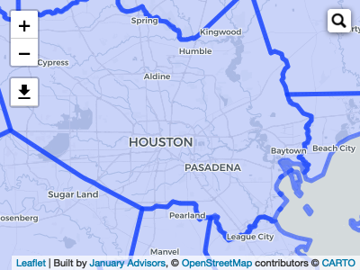

<!-- README.md is generated from README.Rmd. Please edit that file -->

# jaspatial

<!-- badges: start -->


<!-- badges: end -->

The goal of jaspatial is to set up your environment to conduct
geospatial analyses at January Advisors and provide a repository of
common functions we have developed.

## Installation

And the development version from [GitHub](https://github.com/) with:

``` r
# install.packages("devtools")
devtools::install_github("januaryadvisors/jaspatial")
```

## Set up your environment

When you start a geospatial analysis, load the `jaspatial` library and
then load all the other common geospatial packages and set the correct
options:

``` r
library(jaspatial)
load_geo_packages() 
#This will load: sf, tigris, tidycensus, mapview, 
  #leaflet, leaflet.extras, leaflet.extras2, rmapshaper,
set_geo_options() #Set the correct options for tigris downloads
```

## Clean your data

You can also quickly clean and transform the projection of an sf object
using `clean_shape`. The default projection that comes pre-loaded is
`wgs84`. But you can use others, too.

``` r
clean_tx_counties <- clean_shape(tx_counties) #The default 

#Or change projection
utm14n <- st_crs("+proj=utm +zone=14 +ellps=GRS80 +datum=NAD83 +units=m +no_defs +towgs84=0,0,0")
clean_tx_counties_utm14n <- clean_shape(tx_counties, utm14n)
```

## Using leaflet

This package allows you to get up and running in leaflet really quickly
with `ja_base_map`. The one trick is that you need to add a mapPane
option (=‘polygons’) to any layers you want to appear underneath the map
label names.

``` r
ja_base_map(.zoom_level = 9) %>% 
  addPolygons(
    data = clean_tx_counties,
    options = leafletOptions(pane = "polygons")
  )
```


